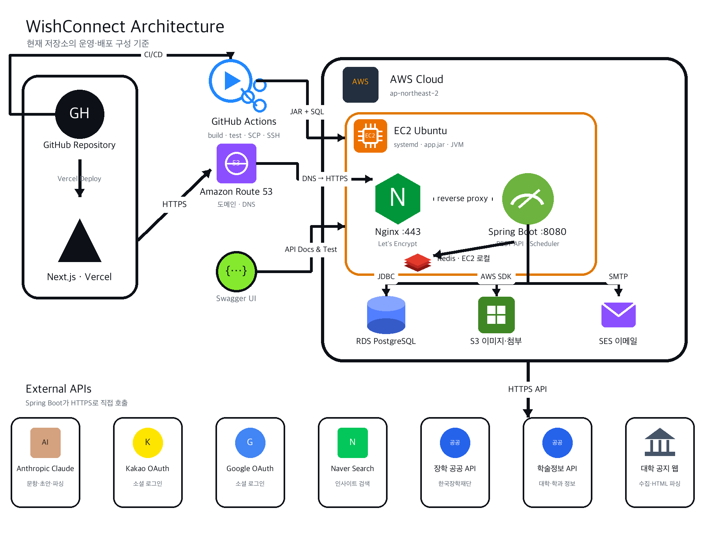

# 🎓 WishConnect — API Server

> 흩어진 장학금 정보를 한곳에, 나에게 맞는 장학금만 골라주는 **장학금 큐레이팅 플랫폼**
> [WishConnect 바로가기](https://wish-connect.com) · [API 서버](https://api.wish-connect.com)

대학생이 장학금을 놓치는 이유는 정보가 없어서가 아니라 **너무 흩어져 있어서**입니다.
WishConnect는 한국장학재단 공공데이터와 전국 대학 장학공지를 매일 자동 수집·정제하고,
사용자의 학적·소득·관심분야에 맞는 공고만 추려서 보여줍니다.
지원까지 이어지도록 마감 알림, 스크랩 아카이빙, AI 자기소개서 작성, 면접 준비까지 한 흐름으로 묶었습니다.

<br>

## 📃 Contents

1. [📌 제출 자료 (ERD · API 명세서 · 아키텍처)](#-제출-자료)
2. [🌱 Developers](#-developers)
3. [🌟 Services](#-services)
4. [🗂 ERD](#-erd)
5. [📖 API 명세서](#-api-명세서)
6. [💻 Architecture & Deploy](#-architecture--deploy)
7. [🔧 Tech Stack](#-tech-stack)
8. [🧱 프로젝트 구조](#-프로젝트-구조)
9. [⚙️ Getting Started](#️-getting-started)

<br>

## 📌 제출 자료

| 자료 | 위치 |
|---|---|
| **ERD** | [바로가기 ↓](#-erd) · [원본 이미지](docs/images/erd.png) |
| **API 명세서** | [바로가기 ↓](#-api-명세서) · [Notion 명세서 (공개)](https://app.notion.com/p/API-a480adbca4ca824ba1ce810b83a1e6e7) |
| **아키텍처 다이어그램** | [바로가기 ↓](#-architecture--deploy) · [원본 이미지](docs/images/architecture.png) |

<br>

## 🌱 Developers

| 팀원 | 역할 | 주요 업무 |
| :---: | :---: | --- |
| <br>[윤기찬](https://github.com/gicks04) | BE (리드) | <ul><li>인증·온보딩·마이페이지 전 구간 (LOCAL/카카오/구글/네이버 로그인, JWT, 이메일 인증)</li><li>장학금 큐레이팅·검색·상세·달력·홈 요약</li><li>알림센터 및 알림 스케줄러</li><li>장학금 수집 파이프라인, 관리자 콘솔, 인프라·배포(EC2·RDS·CI/CD)</li></ul> |
| <br>[현종화](https://github.com/hynzzong) | BE | <ul><li>대학 장학공지 LLM 파서 및 전용 수집기 레지스트리</li><li>중복 장학금 판정·병합 승인 큐</li><li>장학금별 자기소개서 문항 생성</li><li>면접 예상 질문·면접 준비 자료 생성</li></ul> |
| <br>[hahahanjihun](https://github.com/hahahanjihun) | BE | <ul><li>장학금 검색 품질 개선 (유형 키워드 토큰화, 대학 축약어, 마감 공고 제외)</li><li>소셜 온보딩 기본정보 단계 보완</li><li>가구정보(household) 저장 정합성 수정</li></ul> |
| ajm6238 | BE | <ul><li>인사이트 콘텐츠 자동 수집 파이프라인 및 목록 조회 API</li><li>아카이빙 목록 조회 API (상태 필터·페이지네이션·isScrapped)</li><li>장학금 검색 추천 키워드 API</li></ul> |

<br>

## 🌟 Services

**🔐 인증 · 온보딩**
- LOCAL 회원가입(이메일 6자리 인증코드, AWS SES) + 카카오 / 구글 / 네이버 소셜 로그인 3종
- 모두 동일한 자체 JWT를 발급하고 `(loginType, providerId)`로 계정을 구분합니다.
- 온보딩 4단계 — 기본정보 → 학적정보 → 가구정보·관심사 → 완료. 단계별 저장이라 이어서 진행할 수 있습니다.

**🎓 장학금 큐레이팅 · 검색**
- 온보딩에서 받은 학적·소득분위·거주지역·관심분야로 조건을 판정해 **자격이 되는 공고만** 큐레이팅합니다.
- 상세 화면에서 조건별 충족/미충족 판정과 추천 이유를 함께 내려줍니다.
- 키워드·카테고리·정렬(마감임박/최신/금액/정확도) 검색, 추천 검색어, 월별 일정 달력을 제공합니다.
- 한국장학재단 공공 API + 전국 대학 장학공지 크롤링을 매일 배치로 수집하고, LLM으로 자격조건을 구조화합니다.

**📁 아카이빙 · 알림**
- 관심 공고를 스크랩해 진행 상태와 D-Day로 관리합니다.
- 마감 임박, 신규 맞춤 장학금, 작성 중 지원서 이어쓰기를 알림센터로 보내고 유형별로 켜고 끌 수 있습니다.

**✍️ AI 자기소개서 · 면접 준비**
- 공고 본문에서 그 장학금의 실제 문항을 뽑아내고, 없으면 기본 문항으로 대체합니다.
- STEP 1 사전 인터뷰 → STEP 2 초안 생성·수정·저장 → 완료의 3단계로 진행합니다.
- 면접이 있는 장학금은 예상 질문과 질문의도·답변 Tip·예시답변·구성가이드를 함께 생성합니다.

**💡 인사이트**
- 장학금 후기·정보·팁 콘텐츠를 외부에서 수집해 카테고리·출처·태그로 탐색합니다.

**🛠 관리자 콘솔**
- 수집 현황·이상 탐지·파싱 실패 원본 확인, 수기 등록/수정, 엑셀 일괄 반영, 오등록 신고 처리, 감사 로그.
- 관리자 화면은 인터넷에 열지 않고 **SSH 터널로만** 접근합니다. ([deploy/README.md](deploy/README.md))

<br>

## 🗂 ERD

42개 엔티티로 구성되어 있습니다. 사용자(`users`·`user_profile`)를 중심으로 장학금(`scholarship`·`raw_scholarship`·`scholarship_condition`),
지원서(`essay`·`essay_question`·`essay_answer`·`ai_interview`), 아카이빙(`scrap`), 알림(`notification`), 인사이트(`insight`) 도메인이 연결됩니다.

<a href="docs/images/erd.png"></a>

> 이미지가 작게 보이면 클릭해서 원본 크기로 확인할 수 있습니다. → [docs/images/erd.png](docs/images/erd.png)

<br>

## 📖 API 명세서

- **📎 Notion API 명세서 (공통 규칙 · 도메인별 상세 Request/Response · 실패 케이스)**
  → https://app.notion.com/p/API-a480adbca4ca824ba1ce810b83a1e6e7
- **Swagger UI** — `/swagger-ui/index.html`
  (Swagger 는 로컬·운영 모두 **ADMIN 권한 뒤에** 있습니다. `/admin/login.html` 에서 관리자 로그인 후 접근하세요.
  외부 열람은 위 Notion 명세서를 사용해 주세요.)

### 공통 규칙

| 항목 | 규칙 |
|---|---|
| Base URL | `https://api.wish-connect.com` (모든 엔드포인트는 `/api/v1` 하위) |
| 인증 | `Authorization: Bearer {accessToken}` — Access Token 30분 / Refresh Token 14일(Redis 저장) |
| 응답 포맷 | 모든 응답을 `ApiResponse<T> { success, data, message }` 로 감쌈 |
| 에러 처리 | `CustomException` + `ErrorCode` enum, 전역 `@RestControllerAdvice` |
| 페이지네이션 | `page`(1부터), `size` 쿼리 파라미터 |
| 네이밍 | 리소스는 소문자 복수형, 요청 DTO `~Request` / 응답 DTO `~Response`, 상태값은 대문자 Enum |

### 도메인별 엔드포인트

<details>
<summary><b>🔐 인증 (Auth)</b></summary>

| 기능 | 메소드 | 엔드포인트 |
|---|---|---|
| LOCAL 회원가입 | POST | `/api/v1/auth/signup` |
| LOCAL 로그인 | POST | `/api/v1/auth/login` |
| 로그아웃 | POST | `/api/v1/auth/logout` |
| 토큰 재발급 | POST | `/api/v1/auth/refresh` |
| 카카오 / 구글 / 네이버 로그인 | POST | `/api/v1/auth/{kakao\|google\|naver}/login` |
| 이메일 중복 확인 | GET | `/api/v1/auth/email/check` |
| 이메일 인증코드 발송 | POST | `/api/v1/auth/email/verification-code` |
| 이메일 인증코드 확인 | POST | `/api/v1/auth/email/verify` |
| 비밀번호 재설정 요청 | POST | `/api/v1/auth/password/reset-request` |
| 비밀번호 재설정 코드 확인 | POST | `/api/v1/auth/password/verify` |
| 비밀번호 재설정 | POST | `/api/v1/auth/password/reset` |
| 로그인 아이디 중복 확인 | GET | `/api/v1/auth/login-id/check` |
| 아이디 찾기 요청 / 확인 | POST | `/api/v1/auth/login-id/find-request`, `/find` |

</details>

<details>
<summary><b>📝 온보딩 · 프로필 (Onboarding)</b></summary>

| 기능 | 메소드 | 엔드포인트 |
|---|---|---|
| 내 프로필 조회 | GET | `/api/v1/users/me/profile` |
| STEP 1 기본 정보 저장 | PUT | `/api/v1/users/me/profile/basic` |
| STEP 2 학적 정보 저장 | PUT | `/api/v1/users/me/profile/academic` |
| STEP 3 가구 정보·관심사 저장 | PUT | `/api/v1/users/me/profile/household` |
| STEP 4 온보딩 완료 | POST | `/api/v1/users/me/profile/complete` |
| 학교 검색 (자동완성) | GET | `/api/v1/universities/search` |
| 전공 검색 | GET | `/api/v1/majors/search` |
| 시도 / 시군구 목록 | GET | `/api/v1/regions`, `/api/v1/regions/{regionId}/children` |

</details>

<details>
<summary><b>👤 마이페이지 (MyPage)</b></summary>

| 기능 | 메소드 | 엔드포인트 |
|---|---|---|
| 내 정보 조회 | GET | `/api/v1/users/me` |
| 비밀번호 변경 | PATCH | `/api/v1/users/me/password` |
| 이메일 중복 확인 | POST | `/api/v1/users/me/email/check` |
| 이메일 변경 인증코드 발송 / 확인 | POST | `/api/v1/users/me/email/verification`, `/email/verify` |
| 이메일 변경 | PATCH | `/api/v1/users/me/email` |
| 회원 탈퇴 (soft delete) | DELETE | `/api/v1/users/me` |

</details>

<details>
<summary><b>🎓 장학금 (Scholarship)</b></summary>

| 기능 | 메소드 | 엔드포인트 |
|---|---|---|
| 맞춤 추천 목록 (메인) | GET | `/api/v1/scholarships/curated` |
| 장학금 검색 | GET | `/api/v1/scholarships/search` |
| 추천 검색어 | GET | `/api/v1/scholarships/search/popular-keywords` |
| 장학금 상세 | GET | `/api/v1/scholarships/{scholarshipId}` |
| 장학금 일정 달력 | GET | `/api/v1/scholarships/calendar` |
| 홈 장학금 소식 요약 | GET | `/api/v1/scholarships/home-summary` |
| 추천 노출·클릭 기록 | POST | `/api/v1/scholarships/events` |
| 오등록 신고 / 내 신고 목록 | POST / GET | `/api/v1/scholarships/{scholarshipId}/reports`, `/my-reports` |
| 면접 예상 질문 조회·생성·삭제 | GET / POST / DELETE | `/api/v1/scholarships/{scholarshipId}/interview-questions` |

</details>

<details>
<summary><b>📁 아카이빙 (Archive)</b></summary>

| 기능 | 메소드 | 엔드포인트 |
|---|---|---|
| 아카이빙 목록 조회 | GET | `/api/v1/archive` |
| 장학금 스크랩 | POST | `/api/v1/archive/{scholarshipId}/scrap` |
| 스크랩 해제 | DELETE | `/api/v1/archive/{scholarshipId}/scrap` |

</details>

<details>
<summary><b>✍️ AI 자기소개서 (Application)</b></summary>

| 기능 | 메소드 | 엔드포인트 |
|---|---|---|
| 지원서 목록 조회 | GET | `/api/v1/applications` |
| 지원서 작성 시작 | POST | `/api/v1/applications` |
| 지원서 통합 상세 조회 | GET | `/api/v1/applications/{applicationId}` |
| 장학금 맞춤 문항 생성 | POST | `/api/v1/applications/{applicationId}/questions/generate` |
| STEP 1 사전 인터뷰 | POST | `/api/v1/applications/{applicationId}/questions/{questionId}/interview` |
| STEP 2 답변 관리 (draft/save/confirm) | PUT | `/api/v1/applications/{applicationId}/questions/{questionId}/answer` |
| 면접 준비 자료 조회 / 예시답변 생성 | GET / POST | `/api/v1/applications/{applicationId}/interview-prep` |

</details>

<details>
<summary><b>🔔 알림 (Notification) · 💡 인사이트 (Insight) · 📮 문의</b></summary>

| 기능 | 메소드 | 엔드포인트 |
|---|---|---|
| 알림 목록 | GET | `/api/v1/notifications` |
| 알림 읽음 처리 | PUT / PATCH | `/api/v1/notifications/{notificationId}/read` |
| 알림 전체 삭제 | DELETE | `/api/v1/notifications` |
| 알림 설정 조회 / 변경 | GET / PUT | `/api/v1/notifications/settings` |
| 인사이트 목록 조회 | GET | `/api/v1/insights` |
| 콘텐츠 이용 문의 접수 | POST | `/api/v1/content-inquiries` |

</details>

<details>
<summary><b>🛠 관리자 (ADMIN 전용)</b></summary>

`ROLE_ADMIN` 토큰이 있어야 호출할 수 있습니다.

| 영역 | 엔드포인트 |
|---|---|
| 관리자 인증 | `/api/v1/admin/auth/login`, `/logout` |
| 데이터 현황·수집 원본·이상 탐지 | `/api/v1/scholarships/admin/**` |
| 수집·보완·파싱 배치 수동 실행 | `/api/v1/scholarships/{sync\|collect\|enrich\|parse\|conditions}/**` |
| 중복 장학금 탐지·병합 승인 | `/api/v1/scholarships/merge/**` |
| 장학금 수기 등록·수정·삭제, 엑셀 일괄 반영 | `/api/v1/scholarships/manual/**`, `/admin/manual-excel` |
| 오등록 신고 처리 | `/api/v1/scholarships/reports/**` |
| 콘텐츠 문의 처리 | `/api/v1/admin/content-inquiries/**` |
| 배치 실행 이력 · 시스템 상태 · 감사 로그 | `/api/v1/admin/jobs`, `/admin/system/**`, `/admin/audit-log` |
| 학교·전공 동기화, 인사이트 수집 | `/api/v1/universities/sync`, `/api/v1/insights/sync` |

</details>

<br>

## 💻 Architecture & Deploy



| 구성 | 내용 |
|---|---|
| **CI/CD** | GitHub Actions — `main` push 시 build · test → jar SCP → SSH 재기동 |
| **Compute** | AWS EC2 (Ubuntu, ap-northeast-2) · systemd `wishconnect.service` · `-Xms512m -Xmx1g` |
| **Web** | Nginx :443 (Let's Encrypt) → Spring Boot :8080 리버스 프록시 |
| **DB** | AWS RDS PostgreSQL |
| **Cache** | Redis (EC2 로컬) — Refresh Token, 이메일 인증코드 TTL, 분산 락 |
| **Storage / Mail** | AWS S3 (포스터·첨부 이미지) · AWS SES (인증 메일) |
| **DNS** | Route 53 — `wish-connect.com`(Vercel, FE) / `api.wish-connect.com`(EC2, BE) |
| **External** | Anthropic Claude, 카카오·구글·네이버 OAuth, 네이버 검색, 한국장학재단 공공 API, 학술정보 API, 대학 공지 크롤링 |

운영 서버 설정(systemd·logrotate·스왑·관리자 SSH 터널)은 [deploy/README.md](deploy/README.md)에 정리되어 있습니다.

<br>

## 🔧 Tech Stack

| 구분 | 기술 |
|---|---|
| Language | Java 17 |
| Framework | Spring Boot 3.3.5 (Web, Data JPA, Security, Validation, Mail, Actuator) |
| Database | PostgreSQL · Redis |
| Auth | Spring Security + JWT (jjwt 0.12.6) · OAuth 2.0 (Kakao / Google / Naver) |
| AI | Anthropic Claude Java SDK |
| Docs | springdoc-openapi (Swagger UI) + therapi-runtime-javadoc |
| Infra | AWS EC2 · RDS · S3 · SES · Route 53 · Nginx · GitHub Actions |
| Etc | Jsoup(크롤링) · Apache POI(엑셀) · AWS SDK v2 · Lombok |

<br>

## 🧱 프로젝트 구조

```
src/main/java/com/wishconnect
├── domain
│   ├── auth            # 회원가입·로그인·소셜·토큰·이메일 인증
│   ├── user            # 마이페이지·프로필·온보딩
│   ├── scholarship     # 수집·정제·큐레이팅·검색·상세·신고·관리자
│   ├── application     # AI 자기소개서(인터뷰·초안·면접 준비)
│   ├── archive         # 스크랩 아카이빙
│   ├── notification    # 알림센터·설정·스케줄러
│   ├── insight         # 인사이트 콘텐츠 수집·조회
│   ├── inquiry         # 콘텐츠 이용 문의
│   ├── search          # 추천 검색어
│   └── common          # 지역·학교·전공 마스터
└── global
    ├── config          # Security, CORS, Swagger, Scheduling
    ├── jwt             # 토큰 발급·검증 필터
    ├── exception       # CustomException · ErrorCode · 전역 핸들러
    ├── lock            # 배치 분산 락
    ├── audit           # 관리자 감사 로그
    ├── operation       # 배치 실행 이력·시스템 상태
    ├── common          # ApiResponse 등 공통 응답
    └── util
```

- Java 파일 417개 · 엔티티 42개 · 테스트 클래스 78개

<br>

## ⚙️ Getting Started

clone 후 로컬에서 서버를 띄우기 위한 가이드입니다.
(원본: [환경설정 가이드 (yml)](https://app.notion.com/p/6a10adbca4ca82328bf181d2b3051f8a))

### Prerequisites

- **JDK 17**
- **PostgreSQL** — 로컬에 `wishconnect` 데이터베이스 필요
  ```bash
  createdb wishconnect        # 없을 경우 생성
  ```
- **Redis** (Refresh Token 저장용)
  ```bash
  brew install redis && brew services start redis   # macOS 예시
  ```

### 1. 설정 파일 구조 (민감정보 분리 원칙)

| 파일 | Git | 설명 |
|------|-----|------|
| `application.yml` | ✅ 커밋됨 | 공통 설정. **비밀정보는 절대 여기 넣지 않기** |
| `application-local.yml` | ❌ 커밋 안 됨 | DB·Redis 접속정보 등 로컬 개인 설정 (`.gitignore` 처리됨) |
| `application-local.yml.example` | ✅ 커밋됨 | 위 파일의 템플릿. 복사해서 사용 |
| `application-prod.yml` | ❌ 커밋 안 됨 | 운영 설정. 배포 환경에서 별도 관리 |

### 2. 최초 세팅 (clone 후 1회)

```bash
cd src/main/resources
cp application-local.yml.example application-local.yml
# 이후 application-local.yml 의 값을 본인 로컬 환경에 맞게 수정
```

### 3. 채워야 하는 값

- **PostgreSQL** — `spring.datasource` 의 `url` / `username` / `password`
- **Redis** — `spring.data.redis` 의 `host` / `port` (기본 `localhost:6379`), 비밀번호 있으면 `password`

### 4. 실행

```bash
./gradlew build      # 빌드 + 테스트
./gradlew bootRun    # 서버 실행 (기본 local 프로파일)
```

실행 후 API 문서는 `http://localhost:8080/swagger-ui/index.html` 에서 확인할 수 있습니다. (ADMIN 계정으로 `/admin/login.html` 로그인 필요)

### 5. 프로파일 관리 (개발/운영 분리) — 팀 룰

`application.yml` 의 `spring.profiles.active: local` 이 커밋되어 있어 **모든 환경은 기본적으로 `local` 프로파일로 실행**됩니다.
**운영 배포 시**에는 실행 시점에 덮어씁니다:

```bash
# 실행 인자로 지정
java -jar app.jar --spring.profiles.active=prod

# 또는 환경변수로 지정
SPRING_PROFILES_ACTIVE=prod java -jar app.jar
```

> 💡 운영 민감정보(DB 비밀번호, 카카오 키, JWT secret 등)는 `application-prod.yml` 또는 배포 환경의 **환경변수**로 주입하고, 코드/Git 에는 절대 포함하지 않습니다.

### ⚠️ 주의사항

- `application-local.yml`, `application-prod.yml`, `.env` 는 **절대 커밋 금지** (이미 `.gitignore` 처리됨).
- 설정 항목(키)이 추가/변경되면 반드시 `application-local.yml.example` 도 같이 업데이트해서 **PR 에 포함** → 팀원들이 빠진 키 없이 따라올 수 있습니다.
- 실제 비밀번호/토큰 시크릿은 `.example` 에 넣지 말고 `<PLACEHOLDER>` 형태로만 표기합니다.
